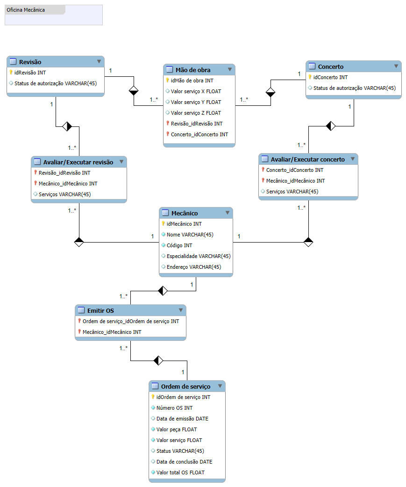

## Projeto conceitual para banco de dados de uma oficina mecânica

### Projeto conceitual de um banco de dados para uma oficina mecânica usando MySQL Workbench. O modelo EER foi exportado para o formato png.

---

Esse projeto faz parte do desafio de código da Formação SQL Database Specialist da DIO. Nele foram aplicados conceitos do modelo EER (Entidade Relacionamento Estendido).

#### 📝 A seguir a lista com soluções para os levantamentos proposto no desafio:

1. Foram criadas duas entidades para os serviços de **concerto** e **revisão** cada qual contendo um status de autorização do cliente para execução dos serviços

2. A partir do relacionamento das entidades **concerto** e **revisão** com a entidade **mecânico** surge as entidades **avaliar/executar concerto** e **avaliar/executar revisão** respectivamente. 

    . **avaliar/executar concerto** e **avaliar/executar revisão** possuem o atributo *serviços* já que quando o veículo é entregue ao mecânico o mesmo irá identificar quais serão os serviços necessários

3. Criei a entidade **mão-de-obra**, pois ela servirá de base para calcular o valor dos serviços de concerto ou revisão. Seus atributos são o resumo da tabela de referência para calcular o valor.

4. Do relacionamento da entidade **mecânico** com a entidade **ordem se serviço** surge a entidade **emitir OS**

O diagrama EER ficou então assim:

